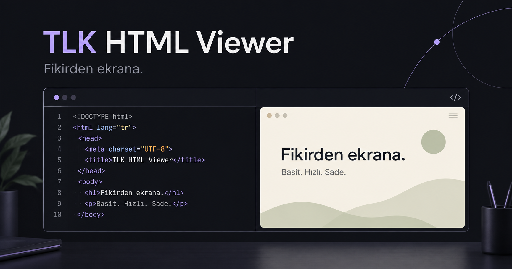

<div align="center">

# TLK HTML Viewer

**From an idea to a live canvas. No installation. No account.**

[**Open the app ↗**](https://talkdedsec.github.io/tlk-html-viewer/) · [Download offline](https://github.com/Talkdedsec/tlk-html-viewer/releases/latest) · [Usage guide](docs/USAGE.md) · [Türkçe](README.tr.md)

[](https://github.com/Talkdedsec/tlk-html-viewer/actions/workflows/ci.yml)
[](https://github.com/Talkdedsec/tlk-html-viewer/actions/workflows/pages.yml)
[](LICENSE)



</div>

A browser workspace for HTML, CSS and JavaScript, with a dark default theme, a full code editor and instant preview. Open an existing HTML file or start from a template. Your code stays in your browser; the app does not upload it. Switch between **English and Turkish** using the header language selector; your preference is remembered without changing your code.

## Start in 10 seconds

1. [Open TLK HTML Viewer](https://talkdedsec.github.io/tlk-html-viewer/).
2. Paste code, or choose **Dosya aç** to open an HTML file.
3. See the preview, then choose **HTML indir** to download the result.

No GitHub login, terminal, Node.js or package installation is needed to use the app.

## The workspace

| Area        | Capabilities                                                           |
| ----------- | ---------------------------------------------------------------------- |
| Editor      | Syntax highlighting, completion, search/replace, folding and undo/redo |
| Preview     | Automatic or manual runs; console output, warnings and errors          |
| Layout      | Split, stacked, code-only, preview-only and mobile tabs                |
| Appearance  | Midnight, graphite and light themes; font size and line wrapping       |
| Devices     | Flexible desktop, 768 px tablet, 375 px phone and fullscreen           |
| Files       | HTML/project JSON import, drag and drop, HTML export, JSON backups     |
| Privacy     | Local browser saving; no app account or source-code upload             |
| Portability | The same workspace bundled into one offline HTML file                  |

## Online and offline

**Online:** [Open the public website](https://talkdedsec.github.io/tlk-html-viewer/).

**Offline:** Download `tlk-html-viewer.html` from the [latest release](https://github.com/Talkdedsec/tlk-html-viewer/releases/latest), then double-click it. All application code and editor dependencies are inside that file. SHA-256 checksums are provided. External resources referenced by your own HTML still require a network connection.

The online app is served by GitHub Pages. Local file selection uses the browser File API; it is not an upload endpoint. Web hosting may retain ordinary access logs.

## Save your work

**HTML indir** combines all panels into a standalone HTML document without the preview console bridge. **Proje kaydet** downloads JSON that preserves all three panels for later editing. Reopen that JSON through **Dosya aç**.

Projects also autosave in localStorage. Storage may be denied, cleared or full; download a project backup for work you want to keep. Local storage is not encrypted.

| Shortcut         | Action                       |
| ---------------- | ---------------------------- |
| Ctrl/Cmd + Enter | Run preview                  |
| Ctrl/Cmd + S     | Download HTML                |
| Ctrl/Cmd + F     | Search/replace in the editor |
| Ctrl/Cmd + Z     | Undo in the focused editor   |
| Tab              | Indent code                  |
| Esc              | Close a dialog               |

## Boundaries

The import limit is 2 MB. Local companion files, npm imports and backend routes are not resolved automatically. Device buttons change viewport width, not the operating system or browser engine.

The preview iframe grants `allow-scripts` only when enabled, never `allow-same-origin`. Forms, popups and top navigation are restricted. Sandboxing does not prevent external requests or infinite loops. Treat imported code as executable code, and only run code you trust. Clipboard and storage behavior on `file://` varies by browser.

[Usage and troubleshooting](docs/USAGE.md) · [Security model](SECURITY.md) · [Architecture](docs/ARCHITECTURE.md) · [Sample HTML](examples/hello.html)

## Development

Only contributors need Node.js 24:

```sh
git clone https://github.com/Talkdedsec/tlk-html-viewer.git
cd tlk-html-viewer
npm ci
npm run dev
```

```sh
npm run typecheck
npm run lint
npm test
npm run build
npm run test:production
npm run build:standalone
npm run test:standalone
```

The web and offline distributions share `app/workspace.tsx`. CodeMirror 6 provides the editor; React and TypeScript power the interface. The standalone build uses esbuild. The optional Sites build preserves the vinext/Vite/Cloudflare pipeline.

CI verifies document composition, project validation, standalone integrity and production server rendering. It is not a claim of complete cross-browser or accessibility testing.

## Contribute

[Report a bug or suggest a feature](https://github.com/Talkdedsec/tlk-html-viewer/issues/new/choose). Read [CONTRIBUTING.md](CONTRIBUTING.md) before opening a pull request. Releases are documented in [CHANGELOG.md](CHANGELOG.md).

MIT © 2026 Talkdedsec.
