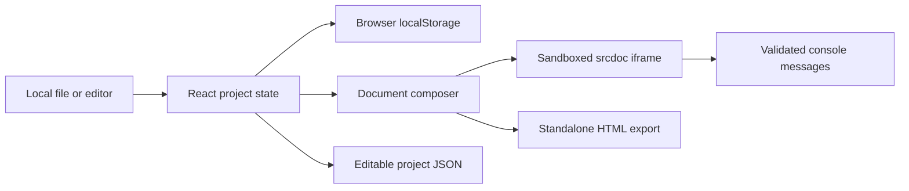

# Architecture

The online, offline and Sites builds share one React workspace. There is no backend API for users' documents.

## Source map

| Location                         | Responsibility                                                       |
| -------------------------------- | -------------------------------------------------------------------- |
| `app/workspace.tsx`              | Application state, responsive workspace and user actions             |
| `app/editor.tsx`                 | CodeMirror configuration and language support                        |
| `app/studio.css`                 | Three themes, layouts, responsive and accessibility styles           |
| `lib/document.ts`                | Pure HTML composition and project validation                         |
| `standalone/main.tsx`            | Browser-only entry point shared by Pages and offline builds          |
| `scripts/build-standalone.mjs`   | Bundle all application code into one HTML, emit checksum             |
| `app/page.tsx`, `app/layout.tsx` | Optional server-rendered Sites entry and metadata                    |
| `build/sites-vite-plugin.ts`     | Preserve Sites deployment metadata in the Worker output              |
| `tests/`                         | Composition, import validation, artifact and production Worker tests |

## Distribution

The GitHub Pages workflow builds the standalone artifact and serves it as `index.html`. The downloadable HTML is the same file. It does not need a CDN, npm, a backend or an account to run. The build checks that no external runtime imports remain and verifies its SHA-256 checksum. Library license notices are retained in the bundle.

Sites uses the existing vinext/Vite/Cloudflare pipeline. A Sites deployment and a GitHub Pages deployment are separate services; changing one does not change the other's audience.

## Data boundaries

User files are read through `File.text()`. Imports are size/type checked before replacing state. Projects are stored in `localStorage`, with errors caught so storage denial does not stop editing. Downloaded project files preserve the three source panels.

The iframe receives generated HTML through `srcdoc`, with only `allow-scripts` when enabled. It never receives `allow-same-origin`. Console events are checked against the active window and render token; text length and retained messages are bounded. This prevents direct access to parent state, but does not protect against resource exhaustion or prevent external network requests by imported content.

The HTML composer is designed for browser documents and fragments, not as a sanitization library or an HTML formatter. Source is meant to execute in the preview. Do not use it to sanitize markup for embedding into a trusted page.

## Validation boundaries

CI verifies types, lint, pure functions, the standalone output and server rendering. It does not claim a full cross-browser accessibility audit. Before shipping UI changes, manually check desktop/mobile layouts, all themes, keyboard navigation, dialogs, storage denial and file import/export.
